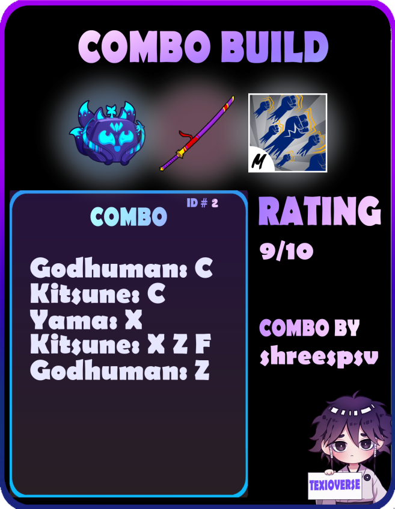
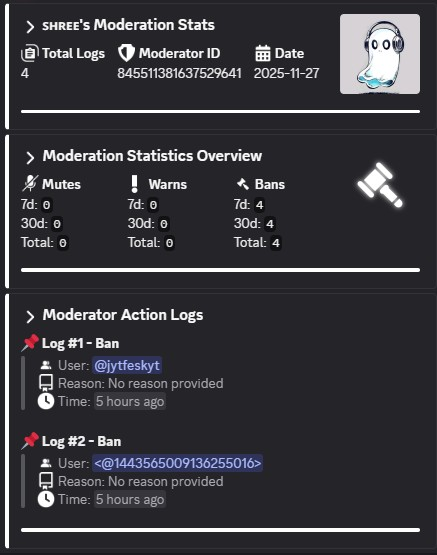

# LILY V2

Multi-purpose Discord bot designed to do almost any stuffs

---

## MODULES
Modules are the **core features** of the bot. Each module consists of different features of the bot that are used generally or specifically depending on the use case.  

All modules are based on **Cogs**, meaning they can be removed or placed depending on the use case.

---

## LIST OF AVAILABLE MODULES
- **Lily Moderation**: focused on moderation  
- **Lily Management**: focused on staff management  
- **Lily Rulesets**: focused on permission allotment  
- **Lily Logging**: focused on error logging and debugging  
- **Lily Utility**: focused on general purpose utilities  
- **Lily Ticketing Tool**: focused on ticket system  
- **Lily Leveling | Economy System**: focused on gaining levels / currency  
- **Lily Algorithms**: focused on sanitizing a given string to appropriate data  

---

## LIST OF AVAILABLE GAME SUPPORT
- **Lily Blox Fruits**: A module dedicated for one of the most famous Roblox games, "Blox Fruits"  
- **Lily Grow a Garden**: A module dedicated for the currently most played Roblox game, "Grow a Garden" with up to 20M concurrent players  

---

## MAIN TECH STACK USED
- Discord.py  
- requests    
- pillow  
- rapidfuzz  
- aiosqlite  

---

# BOT PREVIEW

## BLOX FRUITS Modules

|  |  | 
|:--:|:--:|
| **Stock System** | **Combo System** |

|  |  |  |
|:--:|:--:|:--:|
| **Fruit Values** | **Win / Loss** | **Fruit Suggestor**| 

---

## MODERATION TOOLS

|  |  |
|:--:|:--:|
| **Mod Logs** | **Mod Stats** |

### MODERATION LOGGING

---

## STAFF MANAGEMENT TOOLS

|  |  |
|:--:|:--:|
| **Staff Profile** | **Staff List** |

---

## LEVELING / ECONOMY MODULE

|  |  |
|:--:|:--:|
| **Leveling** | **Profile** |

  
**Leaderboard**

---

## GREETING MODULE: WELCOME AND GOODBYE

---

## CURRENTLY USED
This bot is currently up and running on these servers (mainly designed for those with **Multi-Server Support**):

[Blox Trade | Roblox Blox Fruits](https://discord.gg/bloxtrade)

---

## SUPPORT
Feel free to contact me personally through my Discord **[shreespsv]** if you want more games to be added to the bot.
