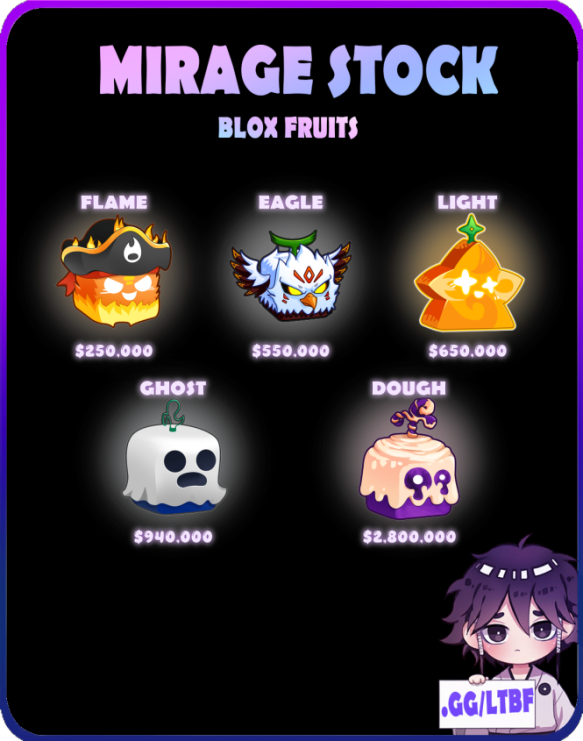
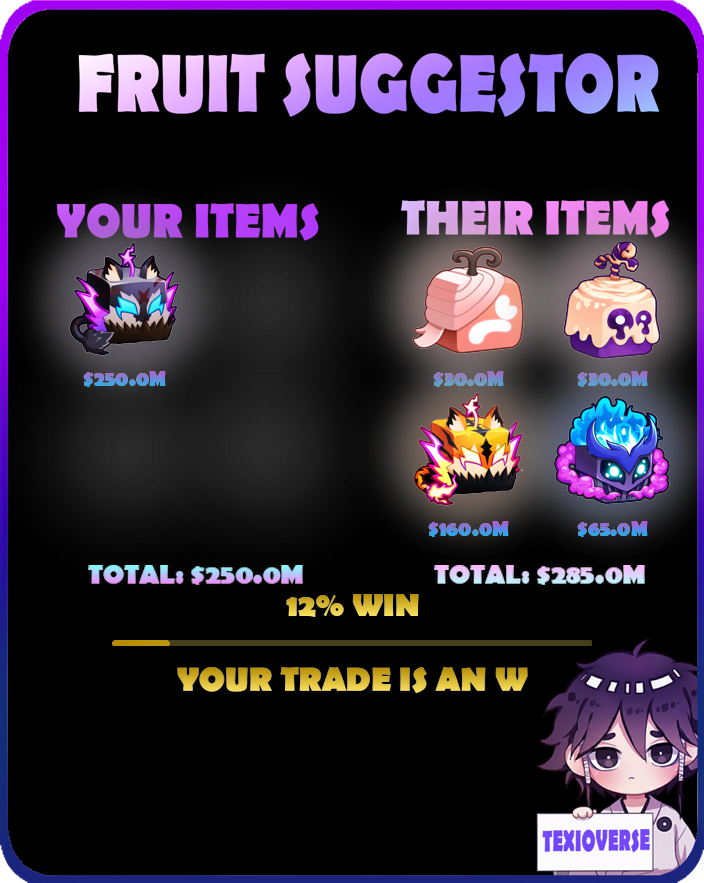
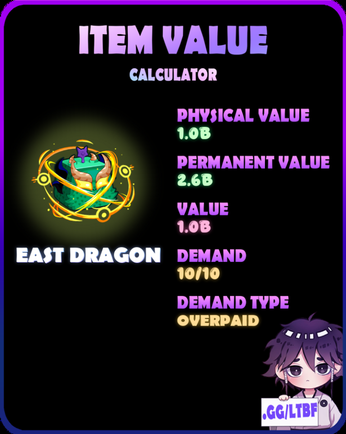
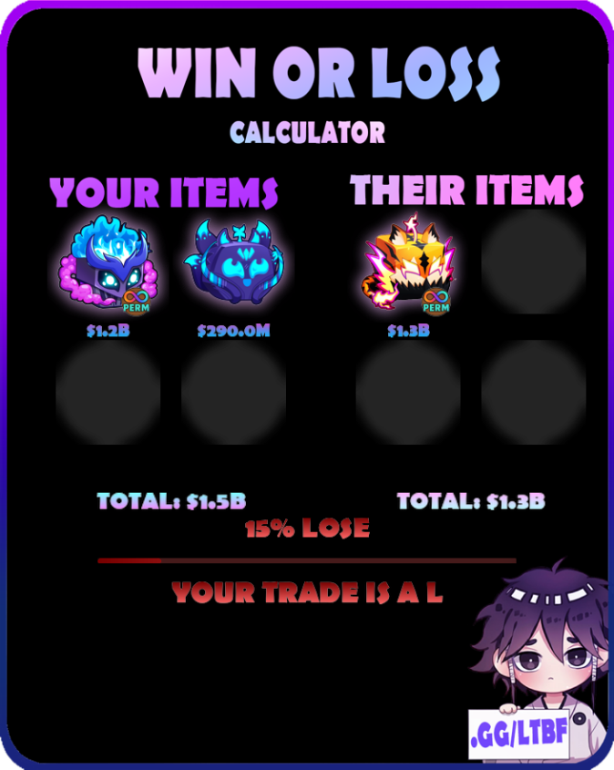
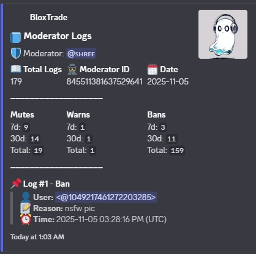
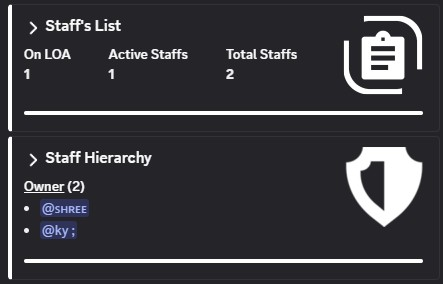

# LILY V2

Multi-purpose discord bot mainly designed to support [Blox Trade](discord.gg/bloxtrade)

## MODULES
- __Modules__ are the __core__ features of the bot. Each modules consists of different features of the bot that are used generally or specifically depending on the used cases

- All modules are based on __Cogs__, meaning they can be removed or placed depending on the used cases

## LIST OF AVAILABLE MODULES
- Lily Moderation : focused on moderation
- Lily Response : focused on auto-responsing system
- Lily Management : focused on staff management 
- Lily Rulesets : focused on permission allotment
- Lily Logging : focused on error loggings | debugging
- Lily Utility : focused based on general purpose
- Lily Ticketing Tool : Focused on ticket system
- Lily Leveling | Economy system : Focused on gaining levels / currency
- Lily Algorthims : focused based on sanitizing a given string to appropriate data

## LIST OF AVAILABLE GAME SUPPORT
- Lily Blox Fruits : A module dedicated for one of the most famous game of roblox "Blox Fruits"

- Lily Grow a Garden : A module dedicated for the current most played game on roblox Grow a garden with highest of 20m active Concurrent Players

## MAIN TECH STACK USED
- Discord.py
- websocket-client
- Beautiful Soup (bs4)
- requests
- polars
- pillow
- rapidfuzz
- aiosqlite

# __BOT PREVIEW__
## BLOX FRUITS Modules

|  |  |
|:--:|:--:|
| **Stock System** | **Fruit Suggestor** |

 

|  |  |
|:--:|:--:|
| **Fruit Values** | **Win / Loss** |

## MODERATION TOOLS

## STAFF MANAGEMENT TOOLS
|  | 
|:--:|:--:|
 
| **Staff Profile** | **Staff List** |

## LEVELING MODULE

## Greeting Module : __Welcome and Goodbye__

## CURRENTLY USED
This bot is currently up and running on these servers [mainly designed for those] [no support for multi-servers until now (WIP!)]

[Blox Trade | Roblox Blox Fruits](https://discord.gg/bloxtrade) 

# SUPPORT
Feel free to contact me personally through my discord [shreespsv] if you guys want more games to be added on the discord bot
