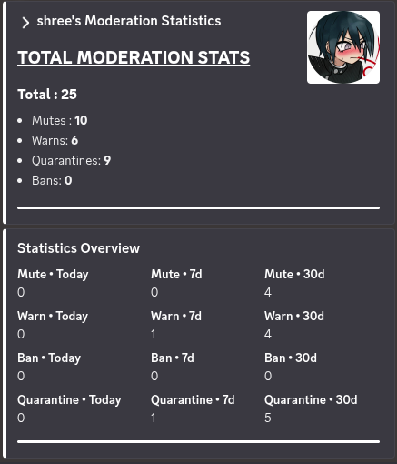
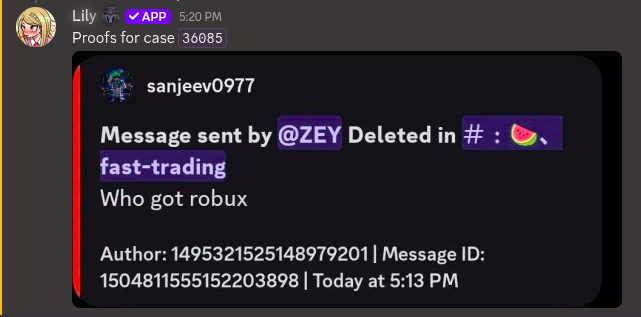
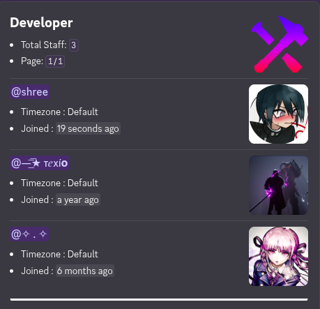

  
  <h1 style="margin: 0;">Lily V2</h1>

Multi-purpose Discord bot designed to do almost any stuffs

---

## MODULES

Modules are the **core features** of the bot. Each module consists of different features of the bot that are used generally or specifically depending on the use case.

All modules are based on **Cogs**, meaning they can be removed or placed depending on the use case.

---

## LIST OF AVAILABLE MODULES

- **Lily Moderation**: focused on moderation
- **Lily Management**: focused on staff management
- **Lily Logging**: focused on error logging and debugging
- **Lily Utility**: focused on general purpose utilities
- **Lily Ticketing Tool**: focused on ticket system
- **Lily Leveling | Economy System**: focused on gaining levels / currency (currently reworking)

---

## LIST OF AVAILABLE GAME SUPPORT

- **Lily Blox Fruits**: A module dedicated for one of the most famous Roblox games, "Blox Fruits"

---

## MAIN TECH STACK USED

- discord.py
- requests
- pillow
- rapidfuzz
- aiosqlite

---

# BOT PREVIEW

## BLOX FRUITS Modules (Images)

|  |  |
| :------------------------------: | :------------------------------------: |
|         **Stock System**         |            **Combo System**            |

|  |  |  |
| :------------------------------------------: | :----------------------------------: | :-----------------------------------------------: |
|               **Fruit Values**               |            **Win / Loss**            |                **Fruit Suggestor**                |

---

## MODERATION TOOLS

|  |  |
| :-------------------------------------: | :-----------------------------------: |
|              **Mod Logs**               |             **Mod Stats**             |

|  |  |
| :-------------------------------------: | :-------------------------------------: |
|           **Proof Retrieval**           |              **Mod Logs**               |

---

## STAFF MANAGEMENT TOOLS

|  |  |
| :-------------------------------------: | :------------------------------------: |
|            **Staff Profile**            |             **Staff List**             |

---

## TICKETING TOOLS

## LEVELING / ECONOMY MODULE

|  |  |
| :-------------------------------------: | :----------------------------------------: |
|              **Leveling**               |                **Profile**                 |

  
**Leaderboard**

---

## GREETING MODULE: WELCOME AND GOODBYE

---

## SUPPORT

Feel free to contact me personally through my Discord **[spshree]** if you want more games to be added to the bot.
